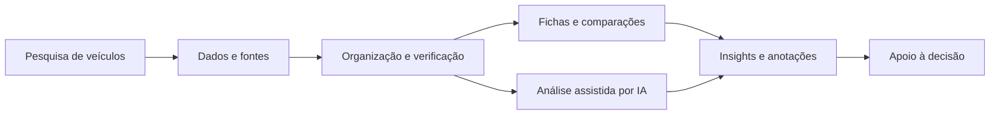
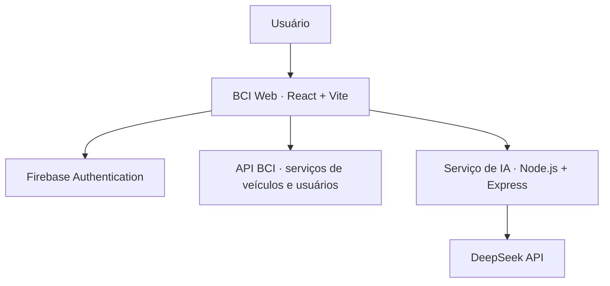

<p align="center">
  
</p>

<h1 align="center">BCI · Beyond Compare Intelligence</h1>

<p align="center">
  <strong>Conheça a concorrência. Transforme informação em inteligência competitiva.</strong>
</p>

<p align="center">
  Plataforma de pesquisa, comparação e análise estratégica de veículos desenvolvida para apoiar equipes de marketing automotivo.
</p>

<p align="center">
  <a href="https://beyond-compare.vercel.app/">Acessar aplicação</a> ·
  <a href="#funcionalidades">Funcionalidades</a> ·
  <a href="#arquitetura-e-tecnologias">Tecnologias</a> ·
  <a href="#executando-localmente">Instalação</a>
</p>

<p align="center">
  
  
  
  
</p>

---

## Visão geral

O **Beyond Compare Intelligence (BCI)** é uma solução de inteligência competitiva voltada à pesquisa e à análise do setor automotivo. Seu objetivo é reduzir a fragmentação de informações sobre veículos concorrentes — incluindo modelos em circulação e futuros lançamentos — e transformar dados técnicos, referências e tendências em conteúdo útil para decisões de marketing.

Em um único ambiente, a equipe pode **pesquisar modelos, confrontar especificações, avaliar evidências, consultar análises apoiadas por IA e organizar o conhecimento produzido**.

> **Mais do que reunir dados, o BCI busca oferecer contexto, rastreabilidade e clareza para decisões estratégicas.**

### O desafio

Informações automotivas estão distribuídas entre sites de fabricantes, notícias, fichas técnicas e outros materiais. A pesquisa manual exige tempo para localizar fontes, verificar divergências e estruturar comparativos — especialmente quando envolve veículos ainda não lançados, sujeitos a mudanças e especulações.

### A proposta

O BCI organiza esse fluxo em uma experiência centralizada, combinando **pesquisa estruturada, comparação, gestão de conteúdo, indicadores de confiabilidade e interpretação assistida por inteligência artificial**. A análise automatizada complementa, mas não substitui, a validação das fontes.

## Funcionalidades

| Módulo | O que oferece |
| :--- | :--- |
| **Pesquisa de veículos** | Busca, consulta de modelos e exploração de informações relevantes do mercado automotivo. |
| **Ficha do veículo** | Visualização de dados técnicos, versões e contexto de cada modelo. |
| **Comparação** | Análise lado a lado de veículos para identificar diferenças, semelhanças e posicionamento competitivo. |
| **Análise com IA** | Síntese interpretativa com pontos fortes, pontos de atenção e panorama geral dos veículos pesquisados. |
| **Fontes e confiabilidade** | Contextualização de evidências e distinção entre dados confirmados e informações estimadas ou especulativas. |
| **Modelos e comparações salvos** | Acesso rápido a consultas importantes para o trabalho recorrente. |
| **Notas e workspace** | Registro e organização de observações associadas ao processo de pesquisa. |
| **Importação e exportação** | Entrada de informações de veículos e saída de dados para análises e relatórios. |
| **Alertas e atividade** | Acompanhamento de notificações e histórico de utilização. |
| **Insights** | Visualização de indicadores e informações consolidadas para apoiar a leitura do mercado. |
| **Conta e perfil** | Autenticação com Firebase, acesso com Google e gerenciamento de informações do usuário. |

### Diferencial: informação com contexto

A plataforma foi pensada para não tratar todos os dados como igualmente certos. **Especificações confirmadas, estimativas e rumores exigem interpretações distintas.** Ao consultar modelos futuros, considere que informações preliminares podem ser revistas antes do lançamento oficial.

### Análise assistida por IA

O serviço de IA utiliza a **API DeepSeek** para apoiar a interpretação estruturada dos dados disponíveis. Os resultados podem ajudar a compreender diferenciais competitivos e pontos de atenção, mas devem ser conferidos antes de qualquer utilização em campanhas ou decisões de negócio.

## Fluxo da solução



## Arquitetura e tecnologias

O projeto utiliza uma arquitetura web com interface React, consumo de API externa e serviço Express para funcionalidades de inteligência artificial.



| Camada | Tecnologias |
| :--- | :--- |
| **Interface** | React 19, JavaScript, HTML, CSS |
| **Build e desenvolvimento** | Vite 8 |
| **Navegação** | React Router 7 |
| **Visualização de dados** | Recharts |
| **Animações e ícones** | Framer Motion, Lucide React, React Icons |
| **Autenticação** | Firebase Authentication |
| **Serviço de IA** | Node.js, Express 5, DeepSeek API |
| **Implantação web** | Vercel |
| **API consumida pelo front-end** | Serviço HTTP hospedado no Render |

### Organização do repositório

```text
BCI/
├── public/                 # Recursos públicos
├── src/
│   ├── components/         # Componentes reutilizáveis
│   ├── config/             # Configurações, incluindo Firebase
│   ├── pages/              # Telas e módulos da aplicação
│   ├── routes/             # Rotas de navegação
│   ├── services/           # Integração com APIs
│   └── App.jsx             # Componente principal
├── server/
│   └── server.js           # Serviço Express para IA
├── package.json
├── vite.config.js
└── README.md
```

## Executando localmente

### Pré-requisitos

- **Node.js** compatível com Vite 8 (recomenda-se Node.js 22.12+).
- **npm**.
- Acesso aos serviços externos necessários para as operações de pesquisa e análise.

### 1. Clone o repositório

```bash
git clone https://github.com/LUMEN-7/BCI.git
cd BCI
```

### 2. Instale as dependências

```bash
npm install
```

### 3. Inicie a aplicação web

```bash
npm run dev
```

Abra o endereço local informado pelo Vite no terminal (normalmente `http://localhost:5173`).

### 4. Execute o serviço de IA (quando necessário)

Configure a chave da DeepSeek em um arquivo `.env` na raiz do projeto:

```dotenv
DEEPSEEK_API_KEY=sua_chave_aqui
PORT=3001
```

Em outro terminal:

```bash
npm run start:ai
```

O serviço utiliza a porta **3001** por padrão. **Nunca publique arquivos `.env` ou chaves privadas no repositório.** A execução local do front-end não substitui a disponibilidade da API remota, atualmente referenciada em `src/services/api.js`. Dependendo da configuração do ambiente, pode ser necessário ajustar as URLs e a política de CORS dos serviços.

### Comandos disponíveis

| Comando | Finalidade |
| :--- | :--- |
| `npm run dev` | Inicia o servidor de desenvolvimento Vite. |
| `npm run build` | Gera o build de produção. |
| `npm run preview` | Visualiza localmente o build. |
| `npm run lint` | Executa o ESLint. |
| `npm run start:ai` | Inicia o serviço Express de IA. |

## Qualidade e cuidados com os dados

- **Rastreabilidade:** sempre verificar as fontes ao utilizar informações em materiais externos.
- **Dados preliminares:** tratar especificações de futuros lançamentos como passíveis de alteração.
- **IA responsável:** revisar saídas automáticas, que podem conter omissões ou interpretações incorretas.
- **Credenciais:** manter tokens, segredos e chaves da API fora do código-fonte e do controle de versão.
- **Acesso:** funcionalidades dependem da autenticação e das permissões fornecidas pelos serviços integrados.

## Aplicação e ecossistema

- **Web:** [BCI — Beyond Compare Intelligence](https://beyond-compare.vercel.app/)
- **Repositório web:** [LUMEN-7/BCI](https://github.com/LUMEN-7/BCI)
- **Versão mobile:** [LUMEN-7/BCI-Native](https://github.com/LUMEN-7/BCI-Native)

A versão mobile é mantida em um repositório separado. Este README documenta especificamente a **aplicação web**.

## Desenvolvimento

Projeto desenvolvido pela **[LUMEN](https://github.com/LUMEN-7)** como proposta de apoio à inteligência competitiva aplicada ao setor automotivo, no contexto do desafio Ford.

Este repositório tem finalidade de desenvolvimento e demonstração da solução. As marcas citadas pertencem aos seus respectivos titulares.

---

<p align="center">
  <strong>BCI · Beyond Compare Intelligence</strong><br />
  <sub>Conheça a concorrência. Vá além da comparação.</sub>
</p>
